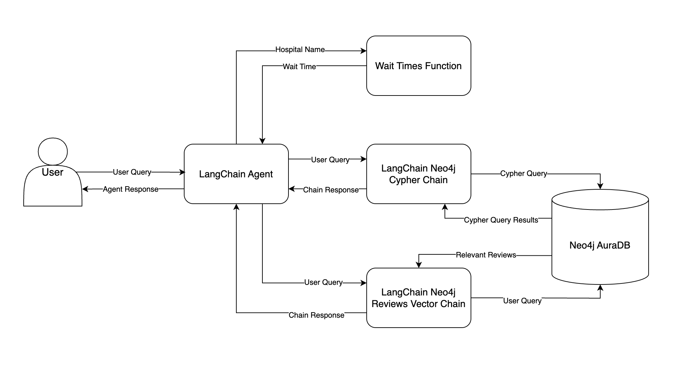

# LLM RAG Chatbot for Hospital Management With LangChain

## Business Requirement
Imagine you’re an AI engineer working for a large hospital system in the US. Your stakeholders would like more visibility into the ever-changing data they collect. They want answers to ad-hoc questions about patients, visits, physicians, hospitals, and insurance payers without having to understand a query language like SQL, request a report from an analyst, or wait for someone to build a dashboard.

To address this, an internal chatbot tool, similar to ChatGPT, has been developed. This chatbot can answer questions about the hospital system’s data.

## Chatbot Design


## Tools and Technology Learned in This Project
- Use LangChain to build personalized chatbots.
- Create a chatbot for a hospital system by aligning with business requirements and leveraging available data.
- Implement graph databases in chatbot design.
- Set up a Neo4j AuraDB instance for the project.
- Develop a Retrieval-Augmented Generation (RAG) chatbot capable of fetching both structured and unstructured data from Neo4j.
- Deploy the chatbot using FastAPI and Streamlit.

## How to Run
1. Create a `.env` file with the following environment variables:

```env
OPENAI_API_KEY=<YOUR_OPENAI_API_KEY>
NEO4J_URI=<YOUR_NEO4J_URI>
NEO4J_USERNAME=<YOUR_NEO4J_USERNAME>
NEO4J_PASSWORD=<YOUR_NEO4J_PASSWORD>

HOSPITAL_AGENT_MODEL=gpt-3.5-turbo-1106
HOSPITAL_CYPHER_MODEL=gpt-3.5-turbo-1106
HOSPITAL_QA_MODEL=gpt-3.5-turbo-0125

CHATBOT_URL=http://host.docker.internal:8000/hospital-rag-agent
```

2. Set up a Neo4j AuraDB instance.
3. Install Docker Compose.
4. Open a terminal and run the following command:

```bash
$ docker-compose up --build
```

## Final Output


## APIs


